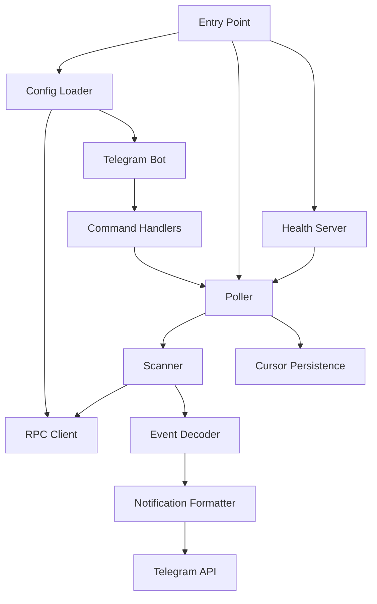

# Component Architecture

A detailed guide to the Mimir Telegram notifier's internal architecture, data flow, and operational behavior. This document describes the actual implementation as found in the source code.

## Overview

The Mimir Telegram notifier is a read-only process that polls two Soroban smart contracts (`mimir-market` and `mimir-squad`) on Stellar Testnet for new on-chain events and posts human-readable notifications to a Telegram chat or channel.

The bot is **read-only**: it holds no signing keys, creates no transactions, and cannot submit state changes to the blockchain. The Stellar chain is the source of truth.

## System Architecture



## Component Responsibilities

### Entry Point (`src/index.ts`)

The application starts in `main()`, which orchestrates initialization in a specific order:

1. **Process handlers** are installed first to catch unhandled rejections and uncaught exceptions.
2. **Configuration** is loaded via `loadConfig()`, which reads environment variables (with optional profile defaults) and fails fast if required values are missing.
3. **RPC client** is created and validated with a `getHealth()` call before announcing readiness.
4. **Poller** is created with dependencies on config, RPC server, and a late-bound send function.
5. **Bot** is created with dependencies on config, poller status, and pause/resume controls.
6. **Send function** is bound to the bot's Telegram API.
7. **Health server** starts on loopback for supervisor probes.
8. **Telegram long-polling** starts (non-blocking).
9. **Poller** starts its loop.
10. **Shutdown handlers** are registered for SIGINT and SIGTERM.

The startup is fail-fast: any configuration error or RPC connectivity issue exits non-zero immediately. After startup, the process is fail-soft: no single failure ends it.

### Configuration (`src/config.ts`)

Configuration is loaded from environment variables with support for profiles (`MIMIR_PROFILE=mock`). The loader validates all values at startup and collects all problems before failing.

**Key configuration sources:**
- Environment variables (primary)
- Profile defaults (fallback for unset values)
- `.env` file via `dotenv/config`

**Configuration categories:**
- **Telegram**: `BOT_TOKEN`, `TELEGRAM_CHAT_ID`, `ALLOWED_CHAT_IDS`, `OPERATOR_TELEGRAM_USER_ID`
- **Stellar**: `MARKET_CONTRACT_ID`, `SQUAD_CONTRACT_ID`, `STELLAR_RPC_URL`, `STELLAR_HORIZON_URL`, `STELLAR_NETWORK_PASSPHRASE`
- **Poller**: `POLL_INTERVAL_MS`, `START_LOOKBACK_LEDGERS`, `CURSOR_FILE`, `MAX_NOTIFICATIONS_PER_CYCLE`
- **Health**: `HEALTH_HOST`, `HEALTH_PORT`, `HEALTH_STALE_MS`
- **Display**: `CHANNEL_PREVIEW_MODE`

### Poller (`src/poller.ts`)

The poller is the central orchestrator that runs a recurring loop to scan contracts and send notifications. It maintains in-memory state for each watched contract and persists cursors to disk.

**Key responsibilities:**
- **Polling loop**: Schedules cycles at `POLL_INTERVAL_MS` intervals
- **Contract scanning**: Calls `readContractEvents()` for each target contract
- **Notification delivery**: Sends formatted messages via Telegram with retry logic
- **Cursor management**: Loads, advances, and persists cursors
- **Operator controls**: Supports pause/resume without affecting cursors
- **Status reporting**: Maintains counters and last-error information

**State management:**
- Per-target state: `cursor` (opaque string), `lastEventLedger` (number), `lastError` (string)
- Global counters: `cycles`, `notificationsSent`, `notificationsFailed`, `eventsSkipped`, `consecutiveFailures`

### Scanner (`src/stellar/events.ts`)

The scanner handles cursor-paginated event retrieval from Soroban RPC. It is designed for tailing, not backfilling, and terminates on cursor advancement rather than payload emptiness.

**Key behaviors:**
- **Sequential pagination**: Uses opaque cursors; cannot parallelize
- **Mutual exclusion**: `startLedger`/`endLedger` and `cursor` are mutually exclusive in requests
- **Retention awareness**: Queries `getHealth()` to get the retained-history floor
- **Page termination**: Walk stops when cursor stops moving or reaches chain tip
- **Bounded scanning**: Limited to `EVENT_MAX_PAGES` (20) pages per scan

**API surface:**
- `paginatedGetEvents()`: Low-level cursor-paginated event retrieval
- `readContractEvents()`: High-level scan with event decoding
- `eventCursorLedger()`: Extracts ledger sequence from opaque cursor

### Event Decoder (`src/stellar/decode.ts`)

The decoder converts raw Soroban events into typed TypeScript objects. It handles both `mimir-market` and `mimir-squad` contracts with specific decoders for each event type.

**Key properties:**
- **Forward-compatible**: Unknown events become `unknown` payloads rather than throwing
- **Deterministic**: Same event always produces same decoded output
- **Safe**: Malformed events never crash the process
- **Atomic amounts**: USDC values remain `bigint` until formatting

**Event types supported:**
- **Market**: `claim_created`, `claim_challenged`, `claim_resolved`, `claim_cancelled`, `market_settled`, `challenger_paid`, `fee_claimed`, `withdrawal`, `withdrawal_pending`
- **Squad**: `market_created`, `deposited`, `withdrawn`, `resolved`, `claimed`, `fees_claimed`
- **Admin**: Recognized but not notified (`oracle_changed`, `ownership_transferred`, `fee_policy_*`, etc.)

### Notification Formatter (`src/notifications/format.ts`)

Transforms decoded events into MarkdownV2 messages for Telegram. Uses Telegram's MarkdownV2 format (not legacy Markdown) for reliable rendering.

**Key properties:**
- **One event, one message**: Each notification is self-contained
- **MarkdownV2 safe**: All interpolated values are escaped
- **Bounded fields**: Contract strings clipped at 200 Unicode code points
- **Explorer links**: Includes transaction links to stellar.expert
- **Preview mode**: Optional `[PREVIEW MODE]` badge for testing

### Telegram Integration (`src/bot.ts`)

The bot uses grammy for Telegram integration with a thin command layer and a single send path for the poller.

**Command handlers:**
- `/start`, `/help`: Bot information and command list
- `/status`: Poller state, cursors, counters, last error
- `/health`: Health assessment and operational readiness
- `/contracts`: Contract IDs and explorer links
- `/preview`: Preview notification formatting
- `/pause`, `/resume`: Operator-only controls (requires `OPERATOR_TELEGRAM_USER_ID`)

**Send path:**
- Single function: `bot.api.sendMessage(config.chatId, text, options)`
- MarkdownV2 parsing mode
- Link preview disabled

### Health Server (`src/health.ts`)

Local HTTP endpoint for process supervisors and deploy checks. Bound to loopback by default.

**Endpoints:**
- `GET /health` (alias `/healthz`): Readiness status (200/503)
- `GET /health/live` (alias `/livez`): Liveness only (always 200)

**Health status determination:**
- **ok**: Poller running and healthy (including intentional pause)
- **degraded**: Poller running but stale or failing repeatedly
- **stopped**: Poller not running

**Safety:**
- JSON-only responses
- No bot tokens, private keys, or unbounded payloads
- Client errors logged and ignored

### RPC Client (`src/stellar/client.ts`)

Thin wrapper around Stellar SDK's `rpc.Server` with explorer URL helpers.

**Key properties:**
- **Read-only**: Only `getEvents` and `getHealth` are used
- **Unauthenticated**: Public Testnet RPC requires no keys
- **HTTP-aware**: Allows HTTP for local quickstart containers

## Data Flow

### Event Processing Pipeline

1. **Poller cycle** starts on schedule
2. **Scanner** queries Soroban RPC with cursor or start ledger
3. **RPC** returns events with opaque cursor for next page
4. **Decoder** converts raw events to typed objects
5. **Formatter** creates MarkdownV2 messages
6. **Send function** delivers via Telegram API with retry
7. **Cursor** is committed after page processing (including failures)
8. **Health server** reflects current status

### Cursor Lifecycle

```
Load from file → Use in RPC request → Receive new cursor → Process events → Save to file
```

## Failure Handling

### Malformed Events

- **Decoder behavior**: `decodeEvent()` never throws; malformed events become `unknown` payloads
- **Poller behavior**: Unknown events are logged and skipped for Telegram
- **Cursor impact**: None; cursor advances normally

### RPC Failure

- **Per-contract isolation**: One contract's failure doesn't affect the other
- **Cursor preservation**: Failed scan leaves cursor unchanged
- **Retry behavior**: Next cycle retries from same position
- **Error reporting**: Error text appears in `/status` and logs

### Telegram Failure

- **Retry logic**: Bounded exponential backoff (3 attempts, 1s → 2s → 4s)
- **Cursor commit**: Cursor advances even with failed sends
- **Lossy design**: Deliberately drops failed notifications to avoid infinite replay
- **Rate limiting**: Messages spaced at 1.5s intervals; capped at `MAX_NOTIFICATIONS_PER_CYCLE`

### Stale Cursor

- **Corrupt file**: Treated as cold start
- **RPC-rejected cursor**: Kept unchanged; error visible in `/status`
- **Recovery**: Follow incident runbook, not automatic rewind

### Restart Behavior

- **Cold start**: No cursor file → begin `START_LOOKBACK_LEDGERS` behind tip
- **Resume**: Load cursor file → continue from last persisted position
- **Pause state**: Process-local; lost on restart

### Rate Limits

- **RPC**: No explicit handling; relies on public Testnet rate limits
- **Telegram**: Message spacing and cap prevent rate-limiting
- **No retry for rate limits**: Uses same retry logic as other failures

## Logging and Security

### Sensitive Information

**Never logged:**
- Bot tokens
- Private keys or signing material
- Payment proofs
- Unbounded remote payloads
- Sensitive authentication data

**Error handling:**
- Bot tokens redacted from error messages
- Error text bounded to 240 characters
- Object-shaped errors read field-wise

### Log Format

- Timestamps omitted (supervisor responsibility)
- Structured prefixes: `[boot]`, `[poller]`, `[bot]`, `[health]`, `[error]`, `[fatal]`
- Bounded line lengths
- No unbounded remote payloads

## Testing and Development Workflow

### Test Framework

- **Unit tests**: Node's built-in test runner (`node --test`)
- **Mock tests**: Dedicated mock RPC server (`src/stellar/mock-rpc.ts`)
- **Fixtures**: `tests/fixtures/events.json` for event catalog

### Running Tests

```bash
# Full test suite (builds first)
npm test

# Just mock tests
npm run test:mock

# Type checking
npm run typecheck

# Build
npm run build
```

### Mock Profile

`MIMIR_PROFILE=mock` enables local development without credentials:
- Loopback RPC (`http://127.0.0.1:8420`)
- Fixture contract IDs
- Isolated cursor file (`data/cursor.mock.json`)
- Placeholder Telegram values

### Mock Commands

```bash
# Start mock RPC server
npm run mock:rpc

# Dry-run poller against mock
npm run mock:poll

# Scanner against live Testnet
npm run scan

# Scanner against mock
npm run scan:mock
```

### Failure Drills

```bash
# RPC failures
npm run mock:poll -- --fail-events error

# Stale cursors
npm run mock:poll -- --stale-cursor

# Malformed events
npm run mock:poll -- --malformed
```

### Test Safety

- Tests use ephemeral data directories
- No live Testnet access required
- No Telegram credentials required
- No signing keys required

## Local Development

### Prerequisites

- Node.js ≥ 20
- npm

### Setup

```bash
# Install dependencies
npm install

# Copy example environment
cp .env.example .env

# Edit .env with your values (at minimum: BOT_TOKEN, TELEGRAM_CHAT_ID)
```

### Development Commands

```bash
# Start with hot reload
npm run dev

# Build for production
npm run build

# Start production build
npm start

# Docker
docker build -t mimir-telegram-bot .
docker run -d --env-file .env -v $(pwd)/data:/app/data mimir-telegram-bot
```

### Health Probes

```bash
# Check health
curl -s http://127.0.0.1:8787/health | jq

# Check liveness
curl -s http://127.0.0.1:8787/health/live | jq
```

## Operational Considerations

### Deployment Requirements

- **Persistent storage**: `data/` directory must survive restarts
- **One process per chat**: Multiple writers would race on cursor file
- **Supervisor**: Should restart on failure and probe `/health`

### Monitoring

- **Health endpoint**: `GET /health` for readiness
- **Status command**: `/status` for detailed diagnostics
- **Logs**: Structured, bounded, secret-free

### Rollback

- Deploy previous build
- Start against same `CURSOR_FILE`
- Cursor format unchanged (version 1)
- Chain remains source of truth

## Contribution Workflow

### Adding Features

1. Understand existing architecture
2. Follow coding conventions
3. Add fixtures for new event types
4. Update documentation
5. Run checks: `npm run typecheck && npm run build && npm test`

### Adding Fixtures

See [contributor-fixtures.md](contributor-fixtures.md) for detailed guidance.

### Incident Response

See [incident-runbook.md](incident-runbook.md) for operational guidance.
